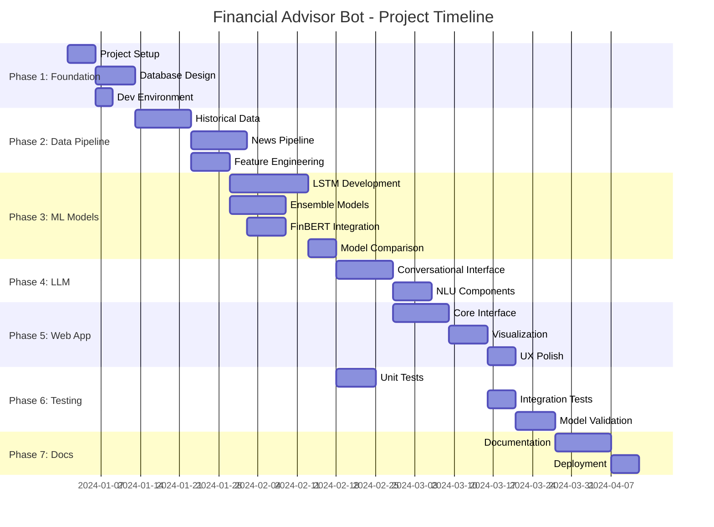

# Financial Advisor Bot – Project Design Document

## Executive Summary

This document provides a structured breakdown of the **AI-Powered Financial Advisor Bot** project into actionable phases, tasks, and subtasks. It also includes recommendations for improvement based on a review of the initial project report.

---

## Project Overview

| Aspect | Details |
|--------|---------|
| **Domain** | Stock Market (S&P 500) |
| **Target Users** | Retail investors seeking data-driven, accessible financial advice |
| **Core Technologies** | Python, Streamlit, TensorFlow/Keras, FinBERT, SQLite, Plotly |
| **Repository** | [GitHub Link](https://github.com/fawntasia/financial-advisor-bot.git) |
| **Architecture** | Batch processing with pre-computed predictions |

---

## Phase 1: Foundation & Infrastructure

### 1.1 Project Setup
| Subtask | Description | Priority |
|---------|-------------|----------|
| 1.1.1 | Create virtual environment and `requirements.txt` | High |
| 1.1.2 | Set up project directory structure | High |
| 1.1.3 | Configure logging and error handling framework | Medium |

### 1.2 Database Design
| Subtask | Description | Priority |
|---------|-------------|----------|
| 1.2.1 | Design SQLite schema for stock data (OHLCV) | High |
| 1.2.2 | Design schema for sentiment scores | High |
| 1.2.3 | Design schema for model predictions | High |
| 1.2.4 | Create database migration/initialization scripts | Medium |
| 1.2.5 | Implement database access layer (DAL) | Medium |

### 1.3 Development Environment
| Subtask | Description | Priority |
|---------|-------------|----------|
| 1.3.1 | Document development setup instructions | Medium |
| 1.3.2 | Set up testing framework (pytest) | Medium |
| 1.3.3 | Configure code linting (flake8/black) | Low |

---

## Phase 2: Data Pipeline Development

### 2.1 Historical Data Ingestion
| Subtask | Description | Priority |
|---------|-------------|----------|
| 2.1.1 | Implement yfinance API wrapper for S&P 500 tickers | High |
| 2.1.2 | Create batch download script for historical OHLCV data | High |
| 2.1.3 | Implement data validation and cleaning functions | High |
| 2.1.4 | Store historical data in SQLite database | High |
| 2.1.5 | Create daily update scheduler/cron job | Medium |

### 2.2 News & Sentiment Data Pipeline
| Subtask | Description | Priority |
|---------|-------------|----------|
| 2.2.1 | Integrate financial news API (e.g., NewsAPI, Alpha Vantage) | High |
| 2.2.2 | Implement news headline scraper with rate limiting | Medium |
| 2.2.3 | Create news storage schema with timestamp indexing | High |
| 2.2.4 | Build headline-to-ticker mapping logic | Medium |
| 2.2.5 | Implement batch sentiment analysis pipeline | High |

### 2.3 Feature Engineering
| Subtask | Description | Priority |
|---------|-------------|----------|
| 2.3.1 | Calculate technical indicators (RSI, MACD, Bollinger Bands, etc.) | High |
| 2.3.2 | Create lagged features for time-series models | High |
| 2.3.3 | Normalize/standardize features for ML models | High |
| 2.3.4 | Integrate sentiment scores as features | Medium |

---

## Phase 3: Machine Learning Models

### 3.1 LSTM Model Development
| Subtask | Description | Priority |
|---------|-------------|----------|
| 3.1.1 | Design LSTM architecture (layers, units, dropout) | High |
| 3.1.2 | Implement data windowing for sequence creation | High |
| 3.1.3 | Build training pipeline with early stopping | High |
| 3.1.4 | Implement model checkpointing and saving | High |
| 3.1.5 | Create prediction inference function | High |
| 3.1.6 | Evaluate model with MAE, RMSE, MAPE metrics | High |

### 3.2 Ensemble Models (Random Forest / XGBoost)
| Subtask | Description | Priority |
|---------|-------------|----------|
| 3.2.1 | Implement Random Forest classifier for trend prediction | High |
| 3.2.2 | Implement XGBoost classifier with hyperparameter tuning | High |
| 3.2.3 | Create cross-validation pipeline | High |
| 3.2.4 | Implement feature importance extraction | Medium |
| 3.2.5 | Build ensemble voting mechanism | Medium |

### 3.3 Sentiment Analysis with FinBERT
| Subtask | Description | Priority |
|---------|-------------|----------|
| 3.3.1 | Load pre-trained FinBERT from Hugging Face | High |
| 3.3.2 | Implement headline preprocessing (tokenization) | High |
| 3.3.3 | Create batch inference pipeline for sentiment | High |
| 3.3.4 | Aggregate sentiment scores per ticker/day | High |
| 3.3.5 | Store sentiment results in database | High |

### 3.4 Model Comparison & Selection
| Subtask | Description | Priority |
|---------|-------------|----------|
| 3.4.1 | Define consistent evaluation metrics | High |
| 3.4.2 | Create comparison dashboard/report | Medium |
| 3.4.3 | Document model strengths and weaknesses | Medium |
| 3.4.4 | Select best model(s) for production | High |

---

## Phase 4: LLM Integration

### 4.1 Conversational Interface
| Subtask | Description | Priority |
|---------|-------------|----------|
| 4.1.1 | Design prompt templates for financial queries | High |
| 4.1.2 | Integrate OpenAI API or local LLM | High |
| 4.1.3 | Implement context injection (predictions + sentiment) | High |
| 4.1.4 | Create response formatting and guardrails | High |
| 4.1.5 | Add disclaimer generation for all advice | High |

### 4.2 Natural Language Understanding
| Subtask | Description | Priority |
|---------|-------------|----------|
| 4.2.1 | Implement intent recognition for user queries | Medium |
| 4.2.2 | Create ticker extraction from natural language | Medium |
| 4.2.3 | Handle ambiguous queries gracefully | Medium |

---

## Phase 5: Web Application (Streamlit)

### 5.1 Core Interface
| Subtask | Description | Priority |
|---------|-------------|----------|
| 5.1.1 | Create main application layout and navigation | High |
| 5.1.2 | Implement stock search/selection widget | High |
| 5.1.3 | Build chat interface for LLM interaction | High |
| 5.1.4 | Add session state management | Medium |

### 5.2 Data Visualization
| Subtask | Description | Priority |
|---------|-------------|----------|
| 5.2.1 | Create interactive candlestick charts (Plotly) | High |
| 5.2.2 | Overlay technical indicators on charts | Medium |
| 5.2.3 | Display prediction forecasts with confidence intervals | High |
| 5.2.4 | Create sentiment timeline visualization | Medium |
| 5.2.5 | Build portfolio overview dashboard | Low |

### 5.3 UX Enhancements
| Subtask | Description | Priority |
|---------|-------------|----------|
| 5.3.1 | Add loading states and progress indicators | Medium |
| 5.3.2 | Implement error handling with user-friendly messages | Medium |
| 5.3.3 | Add disclaimers and risk warnings | High |
| 5.3.4 | Implement responsive design | Low |

---

## Phase 6: Testing & Validation

### 6.1 Unit Testing
| Subtask | Description | Priority |
|---------|-------------|----------|
| 6.1.1 | Write tests for data ingestion functions | High |
| 6.1.2 | Write tests for feature engineering | High |
| 6.1.3 | Write tests for model inference | High |
| 6.1.4 | Write tests for database operations | Medium |

### 6.2 Integration Testing
| Subtask | Description | Priority |
|---------|-------------|----------|
| 6.2.1 | Test end-to-end data pipeline | High |
| 6.2.2 | Test model training → inference → display flow | High |
| 6.2.3 | Test LLM integration with mock data | Medium |

### 6.3 Model Validation
| Subtask | Description | Priority |
|---------|-------------|----------|
| 6.3.1 | Backtest predictions on holdout data | High |
| 6.3.2 | Validate against walk-forward testing | High |
| 6.3.3 | Compare predictions vs actual market movements | High |

---

## Phase 7: Documentation & Deployment

### 7.1 Documentation
| Subtask | Description | Priority |
|---------|-------------|----------|
| 7.1.1 | Write user guide for the application | High |
| 7.1.2 | Document API/code with docstrings | Medium |
| 7.1.3 | Create model training documentation | Medium |
| 7.1.4 | Complete final dissertation | High |

### 7.2 Deployment Preparation
| Subtask | Description | Priority |
|---------|-------------|----------|
| 7.2.1 | Optimize for local deployment | High |
| 7.2.2 | Create installation/setup script | Medium |
| 7.2.3 | Package models with application | High |

---

## Gantt Chart Overview

---

## Areas for Improvement

### 1. Technical Architecture

> [!IMPORTANT]
> **Recommendation: Add API Abstraction Layer**
> 
> The current design tightly couples data sources (yfinance, news APIs) with processing logic. Consider adding an abstraction layer that allows swapping data providers without code changes.

| Issue | Current State | Recommendation |
|-------|---------------|----------------|
| Data Source Lock-in | Direct API calls to yfinance | Create `DataProvider` interface with pluggable implementations |
| Single Point of Failure | No fallback if yfinance fails | Add secondary data sources (Alpha Vantage, Polygon.io) |
| Caching Strategy | Not mentioned | Implement Redis or file-based caching for API responses |

### 2. Model Robustness

> [!WARNING]
> **Overfitting Risk Identified**
> 
> The report acknowledges overfitting as a concern but doesn't specify concrete mitigation strategies in the implementation.

**Recommended Additions:**
1. **Implement Walk-Forward Validation** – More realistic than standard cross-validation for time-series
2. **Add Regularization Metrics** – Track L1/L2 regularization and dropout effects during training
3. **Ensemble Diversity** – Ensure models are trained on different feature subsets to reduce correlation
4. **Out-of-Sample Testing** – Reserve most recent 3-6 months as pure holdout set

### 3. User Experience Enhancements

| Enhancement | Description | Impact |
|-------------|-------------|--------|
| **Confidence Indicators** | Show prediction confidence bounds (e.g., 70% confidence interval) | High |
| **Model Explainability** | Add SHAP values or feature importance per prediction | High |
| **Historical Accuracy** | Display model's past accuracy for transparency | Medium |
| **Watchlist Feature** | Allow users to track multiple stocks | Medium |
| **Alert System** | Notify when sentiment shifts significantly | Low |

### 4. Security & Compliance

> [!CAUTION]
> **Critical Gap: No Mention of API Key Management**
> 
> The report uses external APIs but doesn't address secure credential storage.

**Required Additions:**
1. Use environment variables or `.env` files for API keys
2. Consider using `python-dotenv` for local development
3. For production: use secrets manager (e.g., AWS Secrets Manager)

### 5. Scalability Considerations

| Concern | Current Design | Improvement |
|---------|----------------|-------------|
| SQLite Limitations | Single-user, file-based | Document migration path to PostgreSQL if needed |
| Model Size | Storing in files | Consider model versioning (MLflow, DVC) |
| Batch Processing | Single-threaded | Add parallel processing with `concurrent.futures` |

### 6. Documentation Gaps

The report should include:
- **API Rate Limits** – Document expected limits and how system handles throttling
- **Error Recovery** – What happens when data fetch fails mid-batch?
- **Model Retraining Schedule** – How often should models be retrained?
- **Data Retention Policy** – How long is historical data kept?

---

## Risk Assessment Matrix

| Risk | Likelihood | Impact | Mitigation |
|------|------------|--------|------------|
| API deprecation/changes | Medium | High | Abstraction layer, unit tests for API calls |
| Model accuracy degradation | High | High | Regular backtesting, automatic alerts |
| Overfitting to historical patterns | High | High | Walk-forward validation, diverse features |
| LLM hallucination | Medium | High | Fact-checking layer, strict prompts, disclaimers |
| Data quality issues | Medium | Medium | Validation checks, outlier detection |
| Scope creep | Medium | Medium | Strict phase gates, MVP focus |

---

## Success Metrics

| Metric | Target | Measurement Method |
|--------|--------|-------------------|
| Prediction Direction Accuracy | > 55% | Backtest on holdout set |
| Sentiment Correlation | > 0.3 correlation with price movement | Statistical analysis |
| User Query Response Time | < 3 seconds | Streamlit performance logging |
| System Uptime | > 99% during testing | Error rate monitoring |
| User Satisfaction | Qualitative feedback | User testing sessions |

---

## Next Steps

1. [ ] Review and approve this design document
2. [ ] Prioritize Phase 1 subtasks
3. [ ] Set up project repository with recommended structure
4. [ ] Begin data pipeline development
5. [ ] Create initial prototype for Chapter 4 submission

---

*Document Version: 1.0*  
*Last Updated: 2026-02-03*
